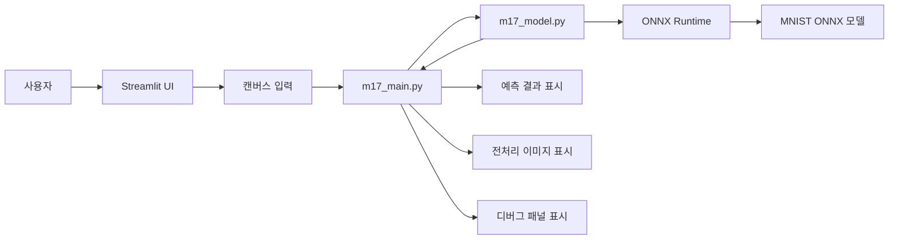
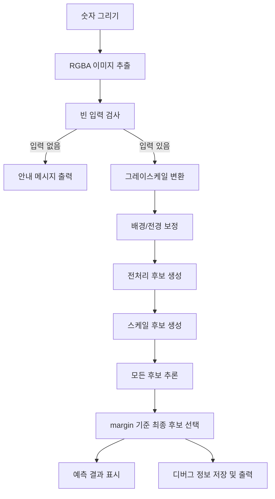

# Mission17 프로젝트 보고서

## 1. 프로젝트 개요

프로젝트명: Mission17 손글씨 숫자 인식기

본 프로젝트는 사용자가 웹 화면에 손으로 숫자를 그리면,
MNIST ONNX 모델을 이용해 해당 숫자를 예측하는 Streamlit 기반 애플리케이션입니다.

이 프로젝트의 목적은 다음과 같습니다.

- AI 모델을 단순 실행하는 수준을 넘어 실제 사용자 입력을 받는 서비스 형태로 구현
- ONNX 모델을 웹 애플리케이션과 연결하는 전체 흐름 이해
- 전처리, 추론, 결과 시각화, 디버그까지 포함한 실전형 구조 경험


## 2. 프로젝트 목표

이번 프로젝트에서 달성하고자 한 목표는 다음과 같습니다.

1. 사용자가 직접 숫자를 그릴 수 있는 입력 화면 제공
2. ONNX 기반 손글씨 숫자 추론 기능 구현
3. 전처리 결과와 클래스별 확률을 함께 확인할 수 있는 UI 구성
4. 추론 오류 원인을 분석할 수 있는 디버그 기능 제공
5. 유지보수가 쉬운 모듈 구조로 코드 분리


## 3. 주요 기능

현재 구현된 주요 기능은 다음과 같습니다.

- 캔버스에 자유롭게 숫자를 그릴 수 있는 입력 UI
- `예측하기` 버튼 클릭 시 추론 실행
- 예측 결과 숫자와 신뢰도 표시
- 0~9 클래스 확률 막대 차트 표시
- 전처리 후 28x28 모델 입력 이미지 미리보기
- 디버그 패널 출력
- 디버그 내용 복사 기능


## 4. 시스템 구성

### 4-1. 모듈 구성

- `src/m17_main.py`
	- Streamlit UI 구성
	- 버튼 이벤트 처리
	- 추론 결과 표시
	- 디버그 출력

- `src/m17_model.py`
	- ONNX 모델 로드
	- 이미지 전처리
	- 다중 후보 추론
	- 최종 결과 선택
	- 디버그 정보 생성

- `data/modelfiles/mnist-12-int8.onnx`
	- 추론에 사용하는 ONNX 모델


### 4-2. 구성 다이어그램




## 5. 전체 처리 파이프라인

### 5-1. 파이프라인 다이어그램




### 5-2. 텍스트 흐름

```text
사용자 입력
	→ 캔버스 이미지 추출
	→ 빈 입력 여부 검사
	→ 그레이스케일 변환
	→ 전처리 후보 생성
	→ 스케일 후보 생성
	→ ONNX 모델 추론
	→ 후보별 점수 비교
	→ 최종 결과 선택
	→ 결과 / 확률 / 디버그 출력
```


## 6. 사용 기술

본 프로젝트에서 사용한 기술은 다음과 같습니다.

- Python
- Streamlit
- ONNX Runtime
- NumPy
- Pillow
- SciPy
- streamlit-drawable-canvas


## 7. 핵심 구현 내용

### 7-1. UI 구현

사용자가 직관적으로 사용할 수 있도록,
검정 배경 위에 흰색 선으로 숫자를 그리는 방식으로 구성했습니다.

또한 다음 정보를 함께 표시하도록 만들었습니다.

- 예측된 숫자
- 신뢰도
- 전체 클래스 확률
- 전처리된 28x28 이미지
- 디버그 정보


### 7-2. 모델 처리 구조

ONNX 모델은 `MnistModel` 클래스로 감싸서 사용했습니다.

이 구조의 장점은 다음과 같습니다.

- 모델 로드 책임 분리
- 전처리와 추론 로직 분리
- UI 코드와 모델 코드 분리
- 테스트와 디버그가 쉬움


### 7-3. 전처리 전략

실제 손그림 입력은 MNIST 데이터와 분포가 다를 수 있기 때문에,
전처리를 한 가지 방식으로만 하지 않고 여러 후보를 두었습니다.

현재 사용한 전처리 방식은 다음과 같습니다.

1. centered
2. direct-resize
3. binary-centered


### 7-4. 입력 스케일 전략

모델 문서상의 입력 설명과 실제 모델 반응이 다를 수 있기 때문에,
다음 스케일 후보를 함께 비교했습니다.

1. normalized-0-1
2. raw-0-255
3. mnist-standardized


### 7-5. 후보 선택 전략

처음에는 softmax 확률의 confidence를 기준으로 후보를 선택했지만,
잘못된 입력에서도 확률이 과도하게 100%로 포화되는 문제가 있었습니다.

이를 해결하기 위해 최종 후보 선택 기준을 다음과 같이 변경했습니다.

- `confidence` 기준 선택
	→ 잘못된 후보도 높은 확률을 보일 수 있음

- `raw score margin(top1 - top2)` 기준 선택
	→ 상위 클래스와 차상위 클래스의 분리 정도를 직접 반영

이 변경으로 추론 후보 비교 기준을 더 안정적으로 만들었습니다.


## 8. 문제점과 해결 과정

### 8-1. 초기 문제

처음 구현에서는 사용자가 어떤 숫자를 그려도 예측값이 `0`으로 치우치거나,
확률이 균일하게 나오는 문제가 발생했습니다.


### 8-2. 원인 분석

디버그 과정에서 다음 가능성을 순차적으로 점검했습니다.

1. 캔버스 값이 제대로 전달되는지 확인
2. 빈 입력 판정이 잘못되는지 확인
3. 전처리 방식이 모델과 맞는지 확인
4. 입력 스케일이 모델과 맞는지 확인
5. softmax 확률 기준 선택이 잘못된 후보를 고르는지 확인


### 8-3. 해결 방법

다음 방법으로 문제를 개선했습니다.

1. 여러 전처리 후보를 동시에 시험
2. 여러 입력 스케일 후보를 동시에 시험
3. 디버그 패널을 추가하여 raw score와 후보 결과를 확인
4. 후보 선택 기준을 confidence에서 margin으로 변경
5. 앱 버전 키를 두어 이전 캐시가 남지 않도록 처리


## 9. 디버그 기능

이 프로젝트에서는 단순히 결과만 출력하지 않고,
문제 분석이 가능하도록 디버그 패널을 함께 구현했습니다.

디버그 패널에서는 다음을 확인할 수 있습니다.

- 입력 메타데이터
- 선택된 전처리 방식
- 선택된 입력 스케일
- raw scores
- confidence
- margin
- 전처리 후보별 결과
- 스케일 후보별 결과

또한 디버그 내용을 버튼으로 복사할 수 있도록 하여,
문제 상황을 빠르게 공유하고 분석할 수 있게 했습니다.


## 10. 코드 구조상의 장점

현재 구조의 장점은 다음과 같습니다.

1. UI와 모델 로직이 분리되어 유지보수가 쉽다.
2. 디버그 정보가 풍부하여 문제 추적이 쉽다.
3. 캐시와 버전 키를 통해 실행 상태 관리가 가능하다.
4. 단일 전처리보다 다양한 입력에 대응하기 쉽다.


## 11. 현재 한계

현재 구현에는 다음 한계가 있습니다.

1. 후보를 여러 번 추론하므로 속도가 다소 느릴 수 있다.
2. MNIST 모델 특성상 실제 손그림과 완전히 일치하지 않을 수 있다.
3. 숫자 모양에 따라 `5`, `6`, `8`, `9`처럼 비슷한 패턴은 혼동 가능성이 있다.
4. 운영 버전에서는 디버그 정보가 과도할 수 있다.


## 12. 향후 개선 방향

향후에는 다음 개선을 고려할 수 있습니다.

1. 실제 사용자 입력 이미지 저장 및 오답 분석
2. 가장 잘 맞는 전처리 1개 또는 2개로 단순화
3. 상위 3개 예측 결과 표시
4. Dockerfile 작성 및 배포 환경 정리
5. 개발 모드 / 운영 모드 분리


## 13. 시연 시나리오

발표 시 다음 순서로 시연할 수 있습니다.

1. 프로젝트 목적 소개
2. 캔버스에 숫자 입력
3. `예측하기` 버튼 클릭
4. 예측 결과와 신뢰도 확인
5. 클래스 확률 막대 차트 확인
6. 전처리 후 28x28 이미지 확인
7. 디버그 패널을 열어 내부 추론 흐름 설명


## 14. 결론

Mission17 프로젝트를 통해,
단순한 모델 실행을 넘어 사용자 입력 기반 AI 서비스를 구성하는 전체 흐름을 구현할 수 있었습니다.

특히 이번 구현에서는 다음이 중요한 성과였습니다.

- ONNX 모델을 실제 웹 UI와 연결
- 전처리와 입력 스케일 문제를 실험적으로 해결
- 디버그 가능한 추론 구조 설계
- 발표와 유지보수에 적합한 문서 구조 분리

즉, 본 프로젝트는 AI 모델 사용, 웹 UI 구성, 추론 디버깅, 문서화까지 포함한
작은 실전형 AI 서비스 프로젝트라고 정리할 수 있습니다.


## 15. 부록

### 15-1. 발표 핵심 한 줄 요약

사용자가 그린 숫자를 ONNX 기반 MNIST 모델로 추론하고,
전처리·스케일 후보 비교와 디버그 기능까지 포함한 손글씨 숫자 인식 웹 애플리케이션입니다.


### 15-2. 발표 핵심 키워드

- Streamlit
- ONNX Runtime
- MNIST
- 전처리 후보 비교
- 입력 스케일 비교
- raw score margin
- 디버그 패널
- 사용자 입력 기반 AI 서비스
