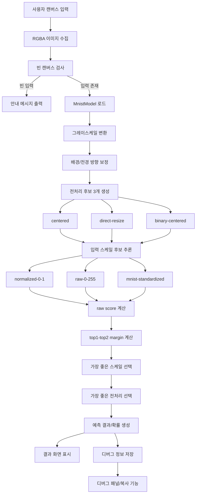

# Mission17 기술 문서

## 0. 문서 역할

이 문서는 Mission17 프로젝트의 기술 설명 문서입니다.

포함 범위:

- 전체 시스템 구조
- UI 흐름
- 모델 추론 파이프라인
- 전처리 / 스케일 / 선택 로직
- 디버그 시스템
- 상태 관리
- 향후 개선 포인트

포함하지 않는 범위:

- 코드 네이밍 규칙
- 클래스/함수 이름 스타일 규칙
- 변수명 규칙

위 내용은 READ.md에서 관리합니다.

## 1. 프로젝트 개요

이 프로젝트는 사용자가 Streamlit 웹 화면의 캔버스에 손글씨 숫자를 그리면,
MNIST ONNX 모델로 추론하여 예측 결과를 보여주는 애플리케이션입니다.

프로젝트 목표는 다음 두 가지를 동시에 만족하는 것입니다.

- 사용자가 바로 쓸 수 있는 간단한 손글씨 숫자 인식 UI 제공
- 추론 오류를 빠르게 추적할 수 있는 디버그 가능한 구조 제공

현재 구현은 다음 두 모듈로 나뉩니다.

- `src/m17_main.py`
  - Streamlit 화면 구성
  - 캔버스 입력 처리
  - 예측 버튼 처리
  - 결과/디버그 패널 출력

- `src/m17_model.py`
  - ONNX 모델 로드
  - 이미지 전처리
  - 다중 전처리 후보 추론
  - 다중 입력 스케일 후보 추론
  - 최종 후보 선택 및 디버그 정보 생성


## 2. 전체 파이프라인

### 2-1. Mermaid 파이프라인




### 2-2. 텍스트 다이어그램

```text
[사용자 입력]
	↓
[Streamlit Canvas]
	↓
[RGBA 이미지 추출]
	↓
[빈 입력 검사]
	↓
[MnistModel.doPredict 호출]
	↓
[전처리 후보 생성]
	├─ centered
	├─ direct-resize
	└─ binary-centered
	↓
[각 후보별 입력 스케일 후보 추론]
	├─ normalized-0-1
	├─ raw-0-255
	└─ mnist-standardized
	↓
[raw score / probability 계산]
	↓
[margin(top1-top2) 기준 최종 후보 선택]
	↓
[예측 결과 + 확률 + 전처리 미리보기 + 디버그 정보 생성]
	↓
[UI 출력]
```


## 3. 기술 스택

### 3-1. 런타임 / 프레임워크

- Python
- Streamlit

### 3-2. 모델 추론

- ONNX Runtime
- ONNX 모델 파일
  - `data/modelfiles/mnist-12-int8.onnx`

### 3-3. 이미지 처리 / 수치 계산

- Pillow
- NumPy
- SciPy `ndimage`

### 3-4. 입력 UI

- `streamlit-drawable-canvas`


## 3-5. 데이터 / 모델 자산

- 모델 파일
	- `data/modelfiles/mnist-12-int8.onnx`
- 테스트 입력/출력 샘플
	- `data/modelfiles/test_data_set_0/input_0.pb`
	- `data/modelfiles/test_data_set_0/output_0.pb`


## 4. 파일별 역할

### 4-1. `src/m17_main.py`

주요 역할:

- 앱 버전 관리
- 모델 캐시 로드
- Streamlit UI 생성
- 캔버스 입력 수집
- 예측 버튼 처리
- 예측 결과를 `session_state`에 저장
- 디버그 패널과 복사 기능 제공

보조 역할:

- 앱 버전 키를 사용한 캐시 무효화
- 마지막 예측 결과 유지
- UI와 모델 계층 분리

핵심 흐름:

1. 앱 시작
2. `Load_Model(APP_VERSION)`으로 모델 준비
3. 사용자가 숫자를 그림
4. `예측하기` 버튼 클릭
5. `MnistModel.doPredict` 호출
6. 예측 결과 / 확률 / 28x28 미리보기 / 디버그 정보 출력


### 4-2. `src/m17_model.py`

주요 역할:

- ONNX 모델 세션 생성
- 입력/출력 메타데이터 확보
- 전처리 후보 생성
- 스케일 후보 생성
- 각 후보 추론
- 후보 선택 기준 계산
- 디버그 정보 생성

보조 역할:

- 입력/출력 메타데이터 분석
- 모델 출력 해석 통일
- 추론 후보 비교 결과 구조화

공개 메서드:

- `doPredict(pil_image)`
- `getSession()`
- `getDebugInfo()`

내부 메서드:

- `_preprocess(arr)`
- `_preprocessDirect(arr)`
- `_preprocessBinary(arr)`
- `_selectOutputName()`
- `_toModelInput(arr, arr_norm)`
- `_reshapeByInputShape(base)`
- `_toProbabilities(scores)`
- `_getScoreMargin(raw_scores)`
- `_doInferDetailed(model_input)`
- `_doInferBestEffort(arr, arr_norm)`
- `_doPredictFromArray(arr, preprocess_name)`


## 5. 상세 로직

### 5-1. 모델 로드

모델은 앱 시작 시 즉시 로드하지 않고,
예측 시점에 `Load_Model(APP_VERSION)`으로 불러옵니다.

이 함수는 `@st.cache_resource`가 적용되어 있으므로,
동일 앱 버전에서는 재사용되고 버전이 바뀌면 새로 로드됩니다.

이 방식의 목적:

- 코드 변경 후 이전 모델 객체가 남는 문제 방지
- Streamlit 재실행 시 불필요한 반복 로드 감소


### 5-2. 캔버스 입력 처리

캔버스는 다음 설정으로 동작합니다.

- 검정 배경
- 흰색 선
- 자유 그리기 모드 고정
- 선 굵기만 사이드바에서 조절

예측 버튼 클릭 시,
캔버스의 `image_data`를 RGBA 이미지로 변환합니다.

그 뒤 그레이스케일 최대값이 너무 작으면 빈 입력으로 판단합니다.

현재 UI 특징:

- `예측하기` 버튼 기반 추론
- 실시간 추론 미사용
- 자유 그리기 모드 고정
- 예측 결과는 마지막 결과를 유지


### 5-3. 전처리 후보 생성

현재는 3개의 전처리 후보를 만듭니다.

#### 1) centered

MNIST 스타일 전처리:

- 바운딩 박스 크롭
- 비율 유지 리사이즈
- 28x28 중앙 배치
- 무게중심 기준 중앙 정렬

#### 2) direct-resize

입력 이미지를 바로 28x28로 축소합니다.

#### 3) binary-centered

이진화 후 centered 전처리를 적용합니다.

전처리 후보를 여러 개 두는 이유:

- 사용자의 필기 위치가 중앙이 아닐 수 있음
- 획의 굵기와 번짐 정도가 일정하지 않음
- 단일 전처리만 사용하면 특정 숫자에서 오차가 커질 수 있음


### 5-4. 입력 스케일 후보 생성

모델 입력 타입이 float인 경우,
다음 스케일 후보를 모두 시험합니다.

#### 1) normalized-0-1

```text
arr / 255.0
```

#### 2) raw-0-255

```text
arr
```

#### 3) mnist-standardized

```text
((arr / 255.0) - 0.1307) / 0.3081
```

입력 타입이 uint8 또는 int8이면,
해당 타입에 맞는 native 경로만 사용합니다.

스케일 후보를 여러 개 두는 이유:

- 문서상의 입력 설명과 실제 모델 반응이 다를 수 있음
- 양자화 모델 또는 변환 모델에서 기대 입력 범위가 다를 수 있음
- 모델이 특정 스케일에서만 분리력이 커질 수 있음


### 5-5. 출력 처리

모델 출력은 `(1, 10)` 형식의 점수 벡터입니다.

출력값이 이미 확률처럼 보이면 그대로 사용하고,
그렇지 않으면 softmax를 적용하여 확률로 변환합니다.

출력 해석 목적:

- 서로 다른 후보 결과를 하나의 규칙으로 비교 가능하게 함
- UI에서는 확률 형태로 일관되게 표시


### 5-6. 후보 선택 기준

후보 선택은 `confidence`만으로 하지 않고,
`raw score margin(top1 - top2)` 기준으로 수행합니다.

이유:

- 잘못된 스케일에서도 softmax가 과도하게 포화될 수 있음
- margin이 더 정보량이 큰 분리 기준이 될 수 있음

선택 순서:

1. 각 스케일 후보별 margin 계산
2. 각 전처리 후보 내부에서 가장 큰 margin을 가진 스케일 선택
3. 전처리 후보들 중 가장 큰 margin을 가진 후보 선택
4. 해당 후보를 최종 예측으로 사용

현재 선택 기준이 필요한 이유:

- 단순 confidence는 과포화된 출력에서 잘못된 후보를 고를 수 있음
- raw score margin은 상위 클래스와 차상위 클래스의 분리 정도를 직접 반영함


## 5-7. 디버그 데이터 생성 흐름

각 예측 후 다음 순서로 디버그 데이터가 쌓입니다.

1. 입력 메타 저장
2. 전처리 후보별 결과 저장
3. 전처리 후보 내부의 스케일 후보별 결과 저장
4. 최종 선택된 후보 저장
5. raw scores / confidence / margin 저장

이 정보는 UI 디버그 패널과 복사 기능에서 그대로 사용됩니다.


## 6. 디버그 시스템

디버그 패널은 최근 예측 1회의 상세 정보를 보여줍니다.

포함 정보:

- input_name
- input_type
- input_shape
- output_name
- selected_preprocess
- selected_scale
- selected_confidence
- selected_margin
- selected_raw_scores
- candidate_preprocesses
- 각 전처리 후보 내부의 scale_candidates

디버그 복사 버튼은 위 전체 정보를 JSON 문자열로 직렬화하여
브라우저 클립보드에 복사합니다.

디버그 시스템 목적:

- 전처리 문제 확인
- 입력 스케일 문제 확인
- 잘못 선택된 후보 확인
- 모델 반응 특성 비교


## 7. 세션 / 상태 관리

`st.session_state`에 다음 정보를 저장합니다.

- `app_version`
- `prediction_result`

`prediction_result` 구조:

```text
pred_class
probs
arr28
debug_info
```

목적:

- 버튼 클릭 후 결과 유지
- UI 재렌더링 시 마지막 예측 결과 유지
- 디버그 복사 기능 지원


## 7-1. 상태 다이어그램

```text
[앱 시작]
	↓
[app_version 확인]
	↓
[prediction_result 초기화 여부 결정]
	↓
[사용자 입력]
	↓
[예측 버튼 클릭]
	↓
[prediction_result 저장]
	↓
[결과/디버그 패널 출력]
```


## 8. 현재 구현상의 장점

- 단순한 단일 모델 호출보다 강건함이 높음
- 전처리/스케일 차이를 다중 후보 방식으로 흡수
- 디버그 정보가 풍부하여 문제 원인 추적이 쉬움
- Streamlit 캐시와 앱 버전 키를 함께 사용하여 관리가 쉬움
- 문서화와 디버그 구조가 분리되어 유지보수가 쉬움


## 9. 현재 한계

- 후보를 여러 번 추론하므로 단일 추론보다 비용이 큼
- 사용자 필기체 특성에 따라 특정 숫자는 여전히 혼동 가능
- 모델 자체가 MNIST 기반이라 실제 손그림 UI 입력과 분포 차이가 있음
- 디버그 정보가 많아 운영 버전에서는 숨기거나 옵션화가 필요할 수 있음
- 전처리 후보와 스케일 후보 조합이 늘어나면 추론 횟수가 증가함


## 10. 향후 개선 아이디어

### 10-1. 정확도 개선

- 사용자 캔버스 데이터를 저장하여 실제 입력 분포 분석
- 임계값, blur, resize 전략 추가 튜닝
- 잘 맞는 전처리 1개만 남기고 단순화

### 10-2. UX 개선

- 예측 결과 상위 3개 표시
- 잘못 인식된 예시 저장
- 입력 이미지 저장소 기능 추가

### 10-3. 운영 개선

- requirements 정리
- Dockerfile 작성
- 환경별 실행 가이드 추가
- 디버그 패널 개발/운영 모드 분리


## 11. 문서 구성 권장안

현재 프로젝트 문서는 다음처럼 분리 유지하는 것이 적절합니다.

- `READ.md`
	- 개발 규칙
	- 네이밍 규칙
	- 코드 작성 원칙

- `TECH.md`
	- 시스템 구조
	- 파이프라인
	- 로직 설명
	- 기술 선택 이유

이렇게 분리하면 개발 규칙 변경과 기술 구조 변경을 서로 독립적으로 관리할 수 있습니다.


## 12. 실행 흐름 요약

```text
앱 시작
  → 모델 준비
  → 사용자 숫자 입력
  → 예측 버튼 클릭
  → 이미지 전처리 후보 생성
  → 스케일 후보 생성
  → 모든 후보 추론
  → margin 기준 최종 선택
  → 예측 결과 출력
  → 디버그 정보 저장/복사
```
